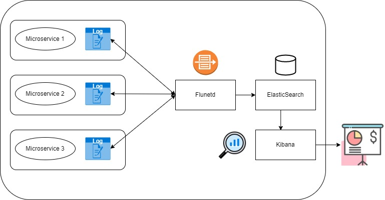
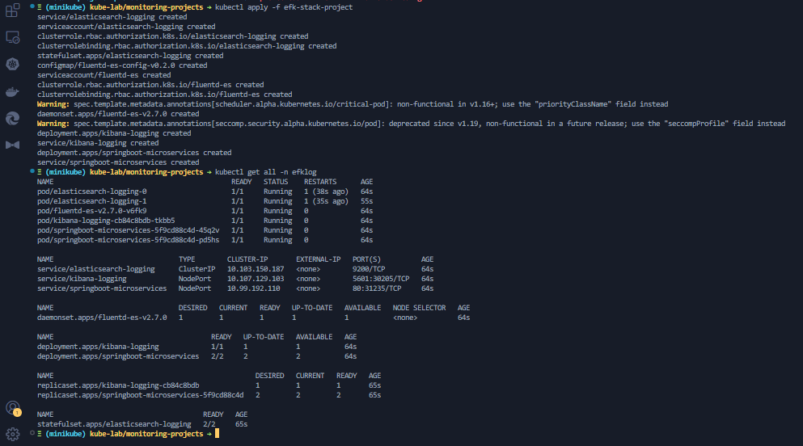

# ElasticSearch Fluentd Kibana Stack Observability Project For A Springboot Microservices App

## Tools Used Here

- DigitalOcean Droplet
- Minikube
- ElasticSearch
- Fluentd
- Kibana

  

## Flow Diagram On How This Works

 

 

## How All The Manifests Get Spinned Up

 

 

- The setup works on a namespace(**efklog**) that can be created using the command : `kubectl create namespace efklog`
- The setup can be spinned up by using the command inside the folder : `kubectl apply -f .`
- The dashboard can be accessed from the addres : `<node-ip>:5601`
- The setup can be brought down by using the command inside the folder : `kubectl delete -f .`