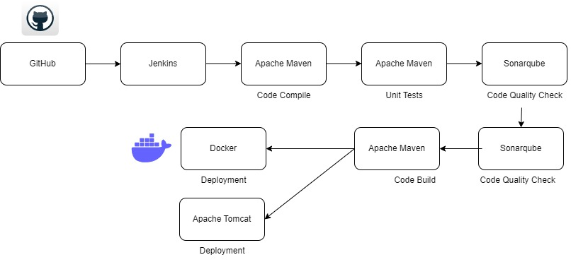
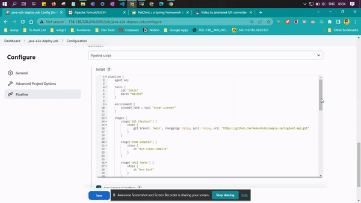

# End to End CICD project involving Compiling, Testing, Building and Deploying

## Tools Used in this project

- DigitalOcean Droplet
- Jenkins
- Tomcat
- Sonarqube
- OWASP Dependency Check Tool
- Maven
- Docker

## Flow Diagram of the Project

 

 

 

## Demo Of the Pipeline

 

**The repo used for this project with all the code is [here](https://github.com/measutosh/sample-springboot-app.git)**

