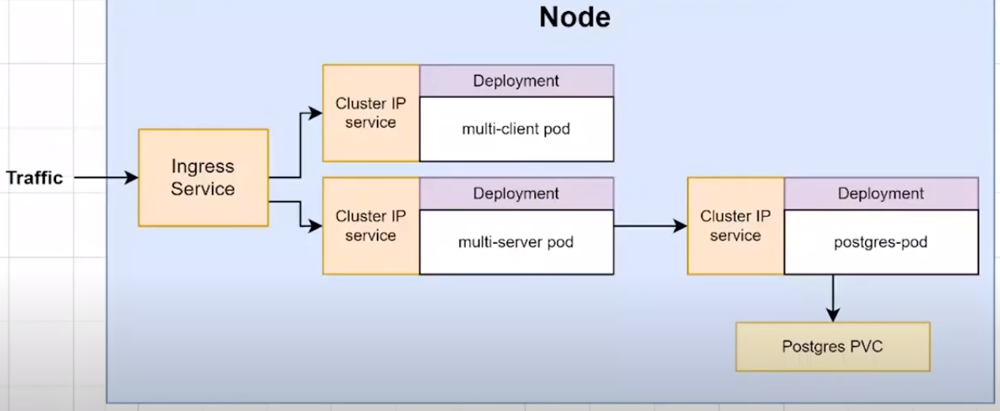
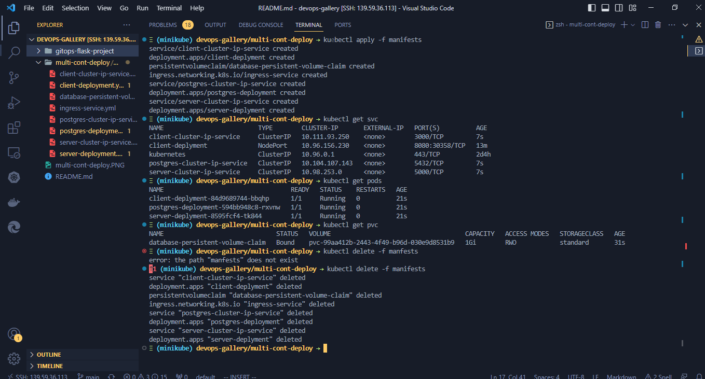

# Multi-Container Full Stack App Deployment On Minikube

## Tools used

- Docker
- Minikube

 

## To spinup the app locally in minikube follow the steps

 

- clone this repo to local
- enter into cloned folder
- run `minikube apply -f manifets`
- similarly to delete the app run `minikube delete -f manifest`

### Steps followed to build this

- Client and its service configuration
- Postgres, its persistentVolumeClaim, service configuration
- Server, its service configuration
- Ingress Nginx controller configuration