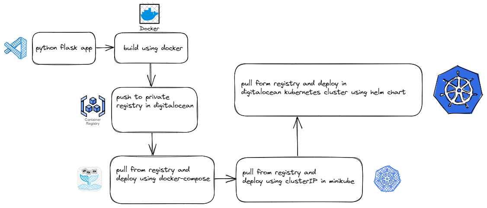
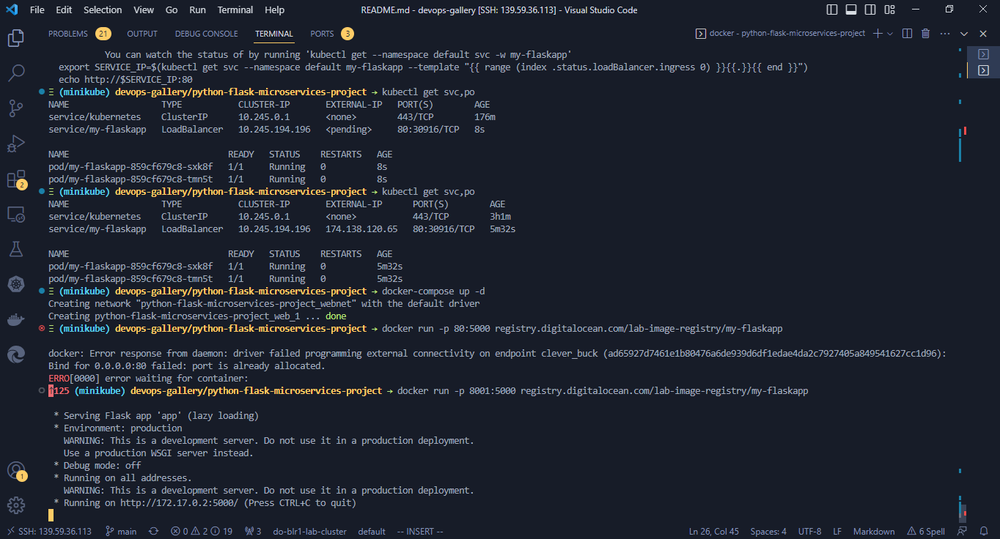
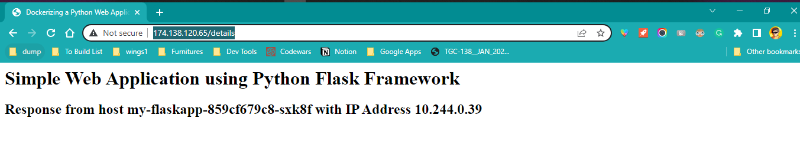

# Python Flask Microservices Deployed in DigitalOcean Kubernetes With Helm Chart

## Flow Diagram



## Output





## Tools Used

- Docker
- Docker Compose
- Minikube
- Digital Ocean Container Registry
- Digital Ocean Kubernetes
- Helm

## Steps followed to build this

- Installing Python 3.X
- Creating Python Virtual Environments
- Installing Python VS Code Extension
- Sample Flask Application
- Jinja templating for Dynamic Web Pages
- Using Pip to Freeze Python Dependencies
- Building the docker image using Dockerfile
    
    - 
    ```
    docker build -t webapp:1.0 .
    docker tag webapp:1.0 registry.digitalocean.com/lab-image-registry/my-flaskapp
    docker push  registry.digitalocean.com/lab-image-registry/my-flaskapp
    docker run -p 80:5000 registry.digitalocean.com/lab-image-registry/my-flaskapp

    access the app at localhost:5000
    ```
- Writing Docker Compose file
    - `docker-compose up -d`
- Writing Kubernetes Manifest files for the application
    - `kubectl apply -f manifests`
- Creating Helm Chart
    - `helm install my-flaskapp my-flaskapp`
